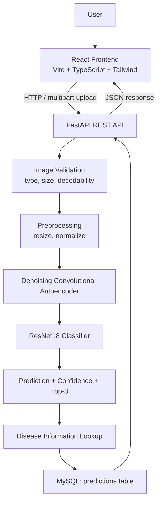
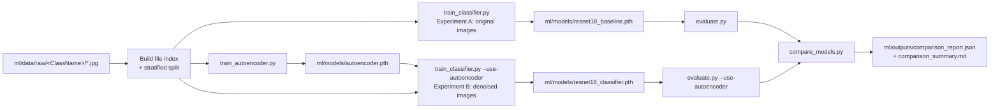
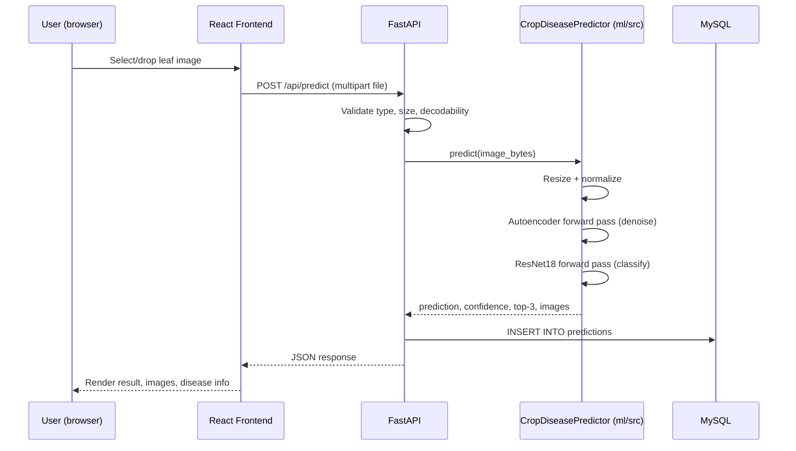

# Architecture

## System overview



## Component responsibilities

- **React Frontend** (`frontend/`): upload UI, result display, history view,
  methodology page. Talks to the backend only over HTTP/JSON.
- **FastAPI backend** (`backend/`): request validation, orchestration of the
  ML inference module, MySQL persistence, disease information lookup.
  Contains no model-training or model-definition code itself — it imports
  the shared `ml/src` package.
- **ML pipeline** (`ml/`): dataset handling, model definitions, training
  scripts, evaluation, and the `inference.py` module reused by the backend.
  Fully independent of the web stack; can be run and tested from the command
  line with no server involved.
- **MySQL** (`crop_disease_detection` database): durable storage for
  prediction history (`predictions` table).

## ML training pipeline



## Request lifecycle for POST /api/predict



## Directory structure

```
crop-disease-detection-system/
├── backend/        FastAPI app, MySQL models, tests
├── ml/             Dataset, autoencoder, classifier, training/eval scripts
├── frontend/       React + TypeScript + Vite + Tailwind UI
├── docs/           This documentation
├── README.md
└── PROJECT_STATUS.md
```
